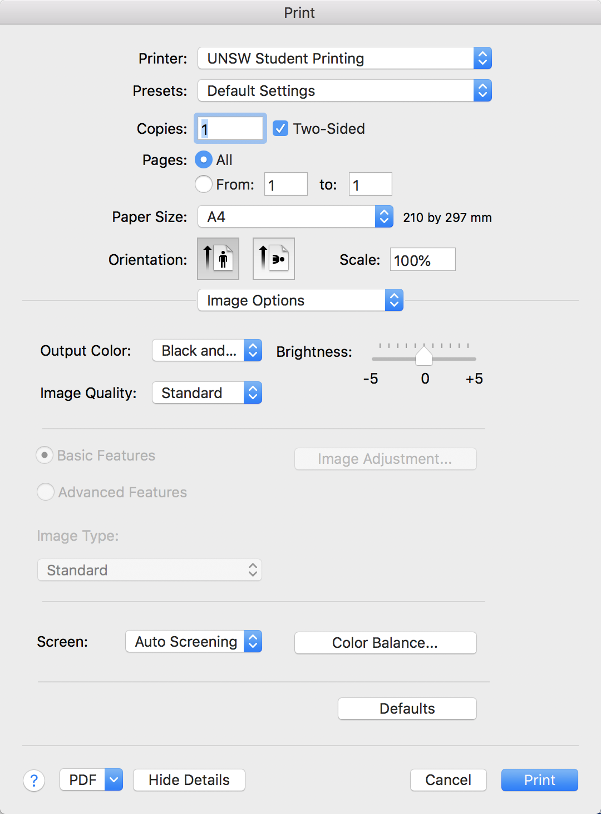

# UNSW Student Printer for macOS

```
The uni offers printing service for students! Hooray!

What??? It charges??? So expensive??? That's terrible. But I'll take it.

Wait... They only provide a web portal for printing? Fine, let's try it.

It doesn't support PDF and asks me to convert to images to upload? You know what? Let's figure it out on our own without using the web portal.
```

## Steps

1. Install printer driver [fxmacprnps1803am108iml.dmg](fxmacprnps1803am108iml.dmg)
2. Add printer to mac using script [install_printer.sh](install_printer.sh)
3. Print as if it's a local printer on your mac! It will prompt for your zID and zPass.
4. By default, it will print out colored pages (expensive), but if you want black & white, change it when you print (Select "Image Options" and then "Output Color"):



5. Go to a printer and print it out! Hooray!

## System Support

This only supports macOS at present. But, it should be **really** easy to port it to Linux and Windows.

Feel free to do so, and PRs are welcome.

## Disclaimer
Figured out by Adam Yi <z5231521@cse.unsw.edu.au>. Under [WTFPL License](LICENSE).

I do not gurantee that this will work, though it should.

Sadly, you still need to pay for the print jobs.

